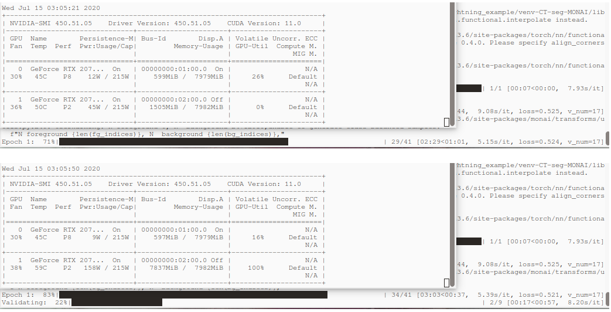

# Volumetric Segmentation with MONAI

Minimum working example for trying to make 3rd party networks to work with MONAI dataset + transformations

## Get Started

```bash
git clone ...sdsadsa.... 
cd 
python3.6 -m venv venv-CT-seg-MONAI
source venv-CT-seg-MONAI/bin/activate
python -m pip install --upgrade pip
pip install git+https://github.com/Project-MONAI/MONAI#egg=MONAI
pip install pytorch-lightning pytorch-ignite
pip install nibabel seaborn scikit-image sklearn
```

## Data

Either with the open-source Spleen dataset from http://medicaldecathlon.com/ or the proprietary CT headset

## Models

### Off-the-shelf MONAI U-Net

Try it with the default off-the-shelf [`U-Net`](https://docs.monai.io/en/latest/_modules/monai/networks/nets/unet.html) from `MONAI` used in their [PyTorch Lightning tutorial](https://github.com/Project-MONAI/MONAI/blob/master/examples/notebooks/spleen_segmentation_3d_lightning.ipynb)

```python 
self._model = monai.networks.nets.UNet(dimensions=3, in_channels=1, out_channels=2,
                                       channels=(16, 32, 64, 128, 256), strides=(2, 2, 2, 2),
                                       num_res_units=2, norm=Norm.BATCH)
``` 

### 3rd Party Pytorch model U-Net variant

The [Attention U-Net: Learning Where to Look for the Pancreas](https://arxiv.org/abs/1804.03999)'s [PyTorch implementation](https://github.com/ozan-oktay/Attention-Gated-Networks/blob/master/models/networks/unet_CT_multi_att_dsv_3D.py) with all the subfunctions in [`model_unet_attention.py`](model_unet_attention.py)

```python 
self._model = unet_CT_multi_att_dsv_3D(n_classes=2,
                                       in_channels=1,
                                       filters=[64, 128, 256, 512, 1024]) # divided by scale = 4, equals the one above
``` 

## To Train

``` 
python monai_pytorch_lighting_demo.py 
```

No input arguments implemented now, change these 

###

a) MONAI vs. 3rd Party: `if_3rdparty = False`


### Spleen vs HeadCT

b) `spleen` vs `custom_head_CT_here`: `def prepare_data(self, dataset = 'spleen'):`

`spleen` (defaults) GPU memory usage starts from 1711 MB during first epoch until validation split, when it reaches validation split, memory usage jumps up to 7979 MB, and stays there.  

#### `Cached` vs. `Standard`

Do `self.dataset_loader = 'cached'` instead of `self.dataset_loader = 'standard'`, for Cached dataloader. 

Spleen dataset (32+9 volumes) takes ~21 of RAM (peak use goes up to ~25 GB) with `cache_rate=1.0`. With the caching.

**With `unet_grid_attention_3D` (lightest of the attention variants):**

GPU ram usage (same use independent of the dataloader, `filters=[16, 32, 64, 128, 256], 171k params`) goes from 2585 MB -> ~6900 MB

**With `unet_CT_multi_att_dsv_3D` (the heaviest of the attention variants):**

GPU ram usage (same use independent of the dataloader) goes from 2327 MB during training volumes, and above 8 GB (`RuntimeError: CUDA out of memory.`) with default `filters=[16, 32, 64, 128, 256]` . When reduced to `filters=[8, 16, 32, 64, 128]` (102k (sic!) parameters), GPU memory usage is 1775 MB -> 7827 MB, and stays close to maximum GPU memory available, leading actually eventually to `RuntimeError: CUDA out of memory` on 2nd validation epoch. With `filters=[4, 8, 16, 32, 64]` (25k parameters) you finally can test this on a consumer GPU, GPU memory use going from 1505 MB -> 7837 MB, and not crashing on 2nd epoch.

  


